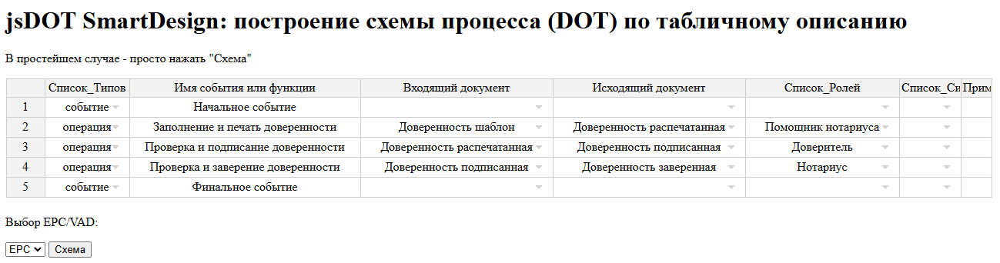
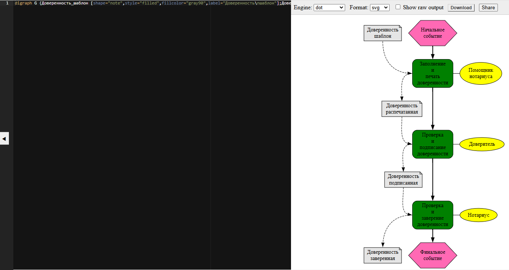

см. upd 1Q2025
## jsDOTsmartDesign
jsDOT SmartDesign - инструмент типа «Таблица -> Схема» для формализации бизнес-процессов. 

jsDOT SmartDesign (jexcel - DOT) демонстрирует как можно использовать технологию SmartDesign через javascript. Строит схему процесса по табличному описанию через промежуточное преобразование в DOT (graphviz). 
jsDOT SmartDesign – урезанная версия exDOT SmartDesign. 
Схемы процессов строятся в процессных нотациях EPC и VAD. В простейшем случае – достаточно нажать кнопку «Схема» и отобразится тестовый простой пример, далее можно редактировать таблицу связей и получить новую схему, соответствующую описанию процесса в табличном виде.

Статьи:
- ВРМ. Смарт-инструменты «Таблица -> Схема» для формализации бизнес-процессов. Рестайлинг ARIS SmartDesign
https://habr.com/ru/articles/810851/
## Инструменты
- для формирования таблицы используется js-библиотека jspreadsheet (ранее jexcel)
https://bossanova.uk/jspreadsheet/v4/

- для визуализаци DOT используется он-лайн сервис GraphvizOnline https://dreampuf.github.io/GraphvizOnline/

Вместо on-line – сервиса GraphvizOnline можно использовать js-библиотеки viz.js \ viz-standalone.js и вызывать генератор схемы непосредственно из скрипта, как показано в примере
https://github.com/mdaines/viz-js
## Сценарии использования
а) Открыть файл jsDOT SmartDesign.html и нажать кнопку «Схема». По умолчанию загружается Пример Простой и отображается его схема. Можно выбрать через выпадающий список тип нотации (ЕРС и VAD).

б) Открыть файл jsDOT SmartDesign.html и ввести в таблицу собственное описание алгоритма процесса. 
Содержание DOT- скрипта в консоли браузера. Таблица ограничена пятью строками, более полный концепт (вкл. редактирование справочников) см. exDOT SmartDesign https://github.com/bpmbpm/exDOTsmartDesign (прототип Aris SmartDesign). 

# upd 1Q2025
Перестало работать, т.к. на bossanova.uk что-то переделали. Переделал с него ссылки на cdnjs.com: https://cdnjs.com/libraries/jexcel  
`https://cdnjs.cloudflare.com/ajax/libs/jexcel/4.6.1/jexcel.min.js` \
`https://cdnjs.cloudflare.com/ajax/libs/jexcel/4.6.1/jexcel.css`

Должно быть так:
1. Открытие jsDOTsmartDesign.html в браузере:
    
2. Нажатие кнопки "Схема"
  
3. Таблицу можно править, например напмсать вместо "Финальное событие" - "Конец событие". При этом нужно учитывать, что при изменении в имени объекта, используемом в таблице несколько раз, нужно указать во всех ссылках на него. Справочники не поддерживаются, т.к. пример упрощенный, более полный с поддержкой \ редактированием справочников см. exDOT SmartDesign.

Ссылки:  
https://www.npmjs.com/package/jexcel
